/mogoon/public/img/logo/banner2.png)

<hr>

<p align="center">
  <a href="https://www.youtube.com/watch?v=PZ7yQIpc1Jo"></img></a> <a href="/WEB(FE)/mogoon/public/img/etc/Mogoon.pdf"></img></a> <a href="https://discord.gg/cAqKQ73N8p"></img></a> <a href="https://www.figma.com/file/lwndb4K2C2mbexyoPkhuY3/MoGoon-%ED%86%B5%ED%95%A9-%EB%94%94%EC%9E%90%EC%9D%B8-%EC%8B%9C%ED%8A%B8?node-id=5%3A8"></img></a>
</p>

<hr>

## 📌프로잭트 소개
건강한 남자라면 반드시 가야하는 군대.   
* 군대에서도 나의 특기를 살리기 위해서
* 해군, 공군, 해병대를 가고 싶어서
* 멋있는 특수부대를 가고 싶어서
* 기타 등등

다양한 이유로 많은 사람들이 모집병으로 군대를 지원하여 갑니다.

그런데 모집병 지원을 위해 병무청에 가보면, 너무 많은 메뉴와 정리되지 않고 그저 나열되기만 한 수많은 정보 속에서 내가 원하는 군과 특기에 대한 정보를 찾아 지원하기는 쉽지 않습니다.

모군은 이렇게 처음 모집병에 지원하는 예비 장병들이 자신이 알고 싶은 특기에 대해 여러가지 정보를 쉽게 얻고 지원할 수 있도록, 군 입대 지원에 필요한 정보들을 보기 쉽게 정리해서 보여주는 서비스입니다.

## 🔔주요 기능
* ### 특기 소개
  * 특기 소개에서는 전체 군종의 모든 특기 리스트를 볼 수 있습니다.   
  * 특기 리스트에서 내가 원하는 군종, 특기 종류를 필터링하여 모아 볼 수 있습니다.   
  * 아직 내가 원하는 군종이나 분야를 고르지 못했다면 '실내근무' '휴가 많음' 같은 특기별 특징 태그를 중심으로 특기를 모아볼 수도 있습니다.

  * 특기를 클릭하면 특기에 대한 상세 설명을 볼 수 있습니다.   
이곳에서 특기에 대한 자세한 정보 뿐만 아니라 다른 사람들의 의견이나 이 특기에 대한 질문들을 모아 볼 수 있습니다.
* ### 군 지원
  * 병무청 홈페이지에는 서류전형에 지원했을 때 몇 점 정도가 나오는지 미리 확인할 수 있는 "내 점수 미리보기" 기능이 있습니다.   
  * 그러나 이 기능은 특기에 상관없이 실제 지원서를 쓰는 것처럼 불필요하게 입력해야하는 정보가 너무 많습니다.   
  * 그래서 모군의 군 지원 기능에서는 구체적으로 정보를 입력하지 않더라도 간단하게 점수를 확인할 수 있는 기능을 제공합니다.   

* ### 마이페이지
  * 마이페이지에는 내가 즐겨찾기한 특기를 확인하거나, 미리 등록한 내 군 지원 정보를 관리할 수 있습니다.
  * 군 지원 탭에서 모의 지원해볼 때 매번 정보를 입력하지 않고 미리 등록한 정보를 토대로 지원해볼 수 있습니다.

## 💻 플랫폼 구성

<table align="center">
	<tr>
		<td>
			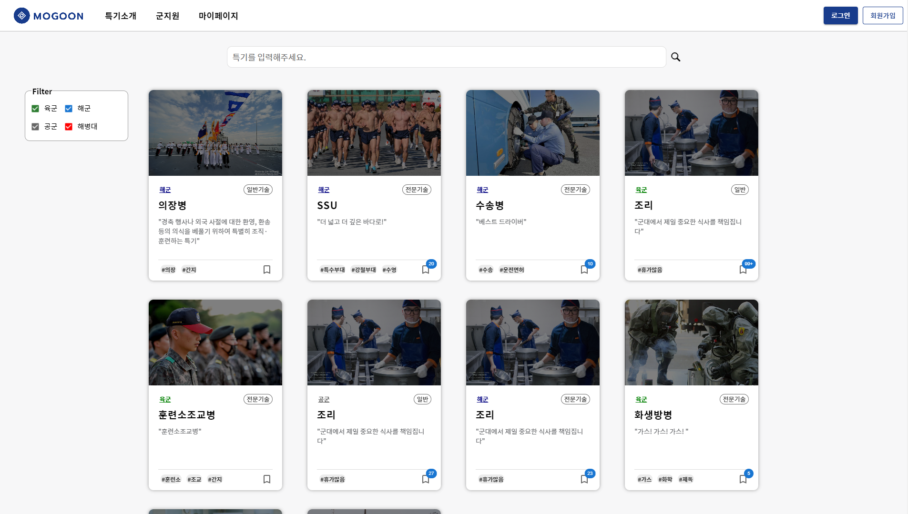
		</td>
		<td>
			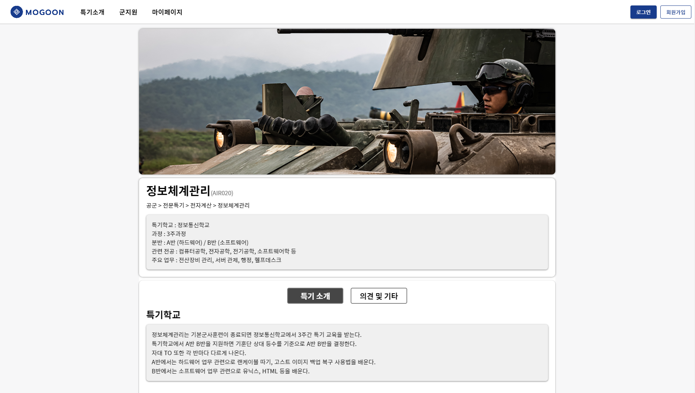
		</td>
	</tr>
	<tr>
		<td align="center">
			<b>특기소개 페이지</b>
		</td>
		<td align="center">
			<b>특기상세 페이지</b>
		</td>
	</tr>
	<tr>
		<td>
			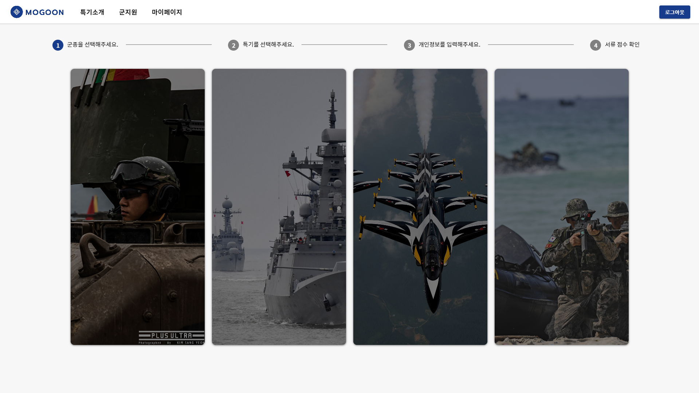
		</td>
		<td>
			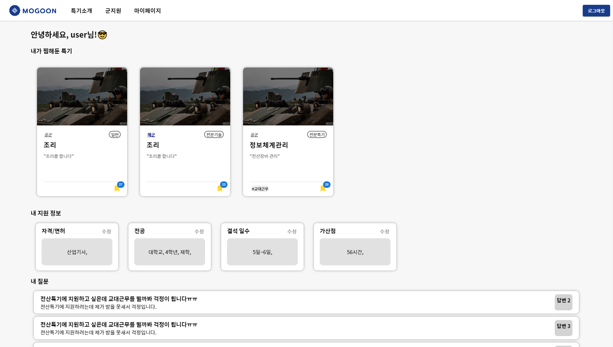
		</td>
	</tr>
	<tr>
		<td align="center">
			<b>군지원 페이지</b>
		</td>
		<td align="center">
			<b>마이페이지</b>
		</td>
	</tr>
</table>

## 🖥 화면 설명

* ### 특기소개

  <table>
    <tr>
      <td align="center">
        <p align="center">
          
        </p>
      </td>
    </tr>
    <tr>
      <td align="center">
        사이트 접속하면 맨 처음 보이는 화면으로 각 군의 전체 특기를 보여줍니다.<br>
        상단의 서치바와 왼쪽의 필터를 통해서 원하는 특기를 조회 할 수 있습니다.<br>
        각각의 특기아이템을 클릭하면 특기 상세페이지로 이동합니다.<br>
      </td>
    </tr>
  </table>
 
* ### 특기상세

  <table>
    <tr>
      <td align="center">
        <p align="center">
          
          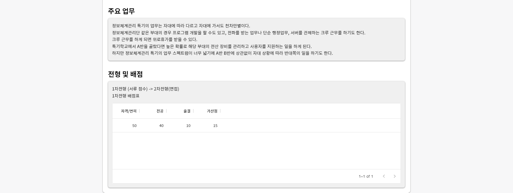
        </p>
      </td>
    </tr>
    <tr>
      <td align="center">
        선택한 특기의 상세 정보를 보여줍니다.<br>
        이 특기에서 하는 주요 업무를 소개하고, 관련 전공에 대한 정보를 제공합니다.<br>
        또한 선택한 특기를 지원할 때 필요한 배점 정보도 한눈에 볼 수 있습니다.<br>
        그 밖에 해당 특기에 대한 여러 정보들을 모아볼 수 있습니다.
      </td>
    </tr>
  </table>

  <table>
    <tr>
      <td align="center">
        <p align="center">
          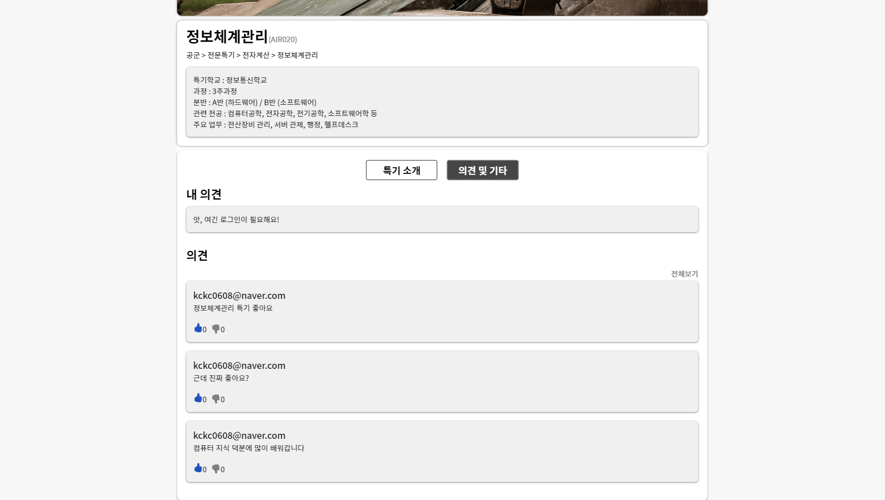
        </p>
      </td>
    </tr>
    <tr>
      <td align="center">
        의견탭을 선택하여 해당 특기의 의견을 볼 수 있습니다.<br>
      </td>
    </tr>
  </table>
 
* ### 군지원

  내가 지원해보고 싶은 특기에 모의 지원 하여 서류점수를 간단하게 확인해볼 수 있습니다.<br>
  군지원은 아래와 같이 총 4가지 단계로 이루어져 있습니다.
  
  1. 군종선택
  
      <table>
        <tr>
          <td align="center">
            <p align="center">
              
            </p>
          </td>
        </tr>
        <tr>
          <td align="center">
            내가 지원하려는 군종을 선택하면 다음 단계로 넘어갑니다.
          </td>
        </tr>
      </table>
    
  2. 특기선택

      <table>
        <tr>
          <td align="center">
            <p align="center">
              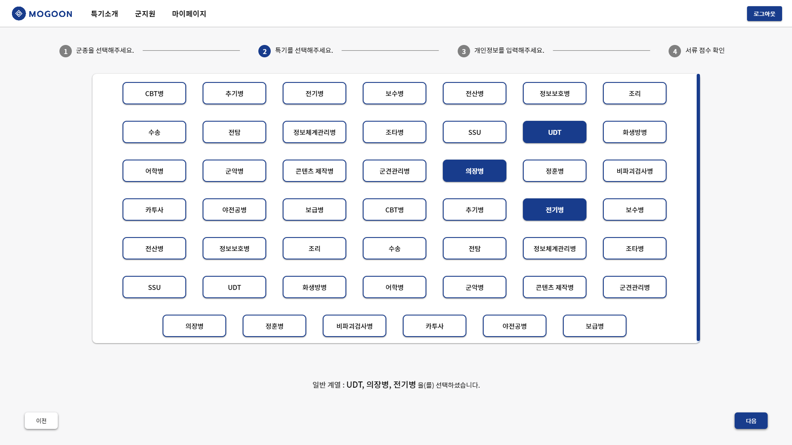
            </p>
          </td>
        </tr>
        <tr>
          <td align="center">
            전  단계에서 선택한 군종의 특기가 나타납니다.<br>
	    특기는 같은 계열만 선택 가능합니다.(일반특기, 전문특기)
          </td>
        </tr>
      </table>
      
      <table>
        <tr>
          <td align="center">
            <p align="center">
              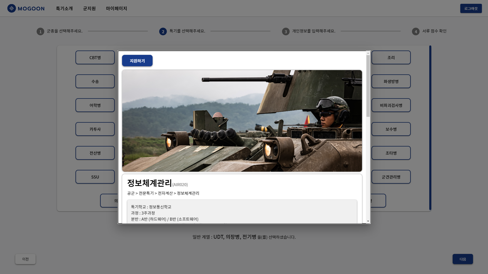
            </p>
          </td>
        </tr>
        <tr>
          <td align="center">
            각 특기에 마우스를 가져가면 보이는 돋보기 버튼을 클릭하여,<br>
            해당 특기의 상세 정보를 볼 수 있습니다.
          </td>
        </tr>
      </table>
      
  3. 정보입력
  
      <table>
        <tr>
          <td align="center">
            <p align="center">
              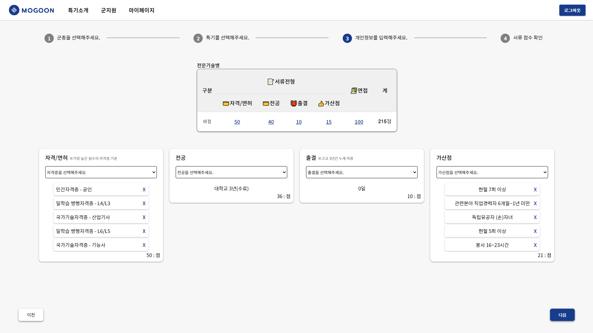
            </p>
          </td>
        </tr>
        <tr>
          <td align="center">
            사용자의 지원 정보를 입력하는 화면입니다.<br>
            전 단계에서 선택한 특기의 계열에 맞는 배점을 보여줍니다.<br>
          </td>
        </tr>
      </table>

      <table>
        <tr>
          <td align="center">
            <p align="center">
              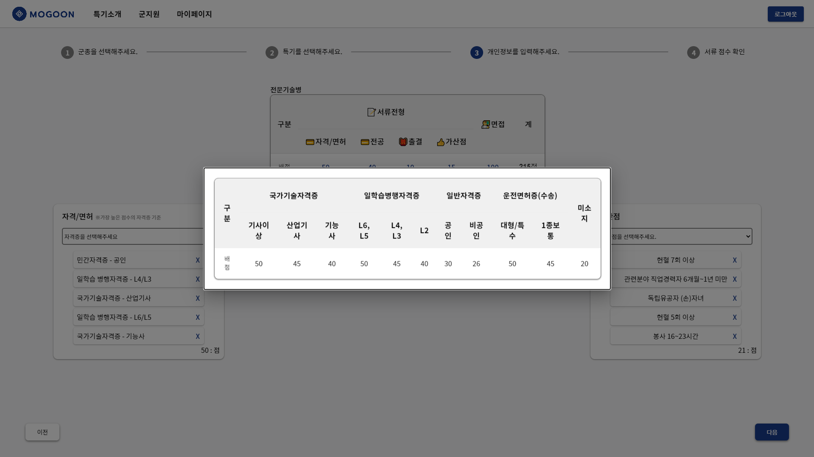
            </p>
          </td>
        </tr>
        <tr>
          <td align="center">
            배점표에서 각 배점 항목을 클릭하면 항목별 상세 배점을 볼 수 있습니다.
          </td>
        </tr>
      </table>
       
  4. 점수확인
  
        <table>
        <tr>
          <td align="center">
            <p align="center">
              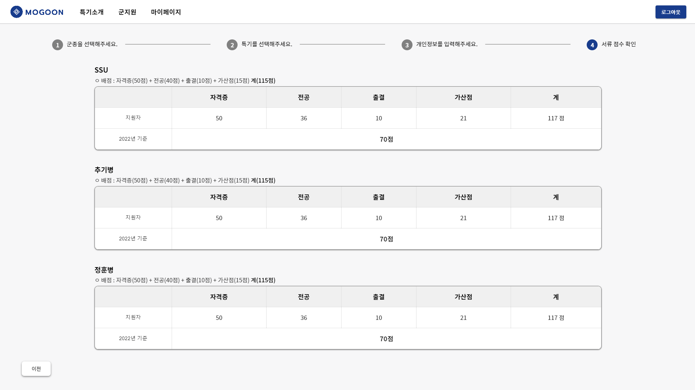
            </p>
          </td>
        </tr>
        <tr>
          <td align="center">
            선택한 특기, 개인정보를 바탕으로 점수를 계산해줍니다.<br>
            최대 3개의 특기의 점수를 확인할 수 있습니다.
          </td>
        </tr>
      </table>
      
* ### 마이페이지

  <table>
    <tr>
      <td align="center">
        <p align="center">
          
        </p>
      </td>
    </tr>
    <tr>
      <td align="center">
        내가 찜한 특기를 한눈에 볼 수 있습니다.<br>
	나의 자격증, 개인 정보를 저장 할 수 있습니다.<br>
        로그인시 이용할 수 있습니다.<br>
      </td>
    </tr>
  </table>
  
* ### 로그인/회원가입

  <table>
    <tr>
      <td align="center">
        <p align="center">
          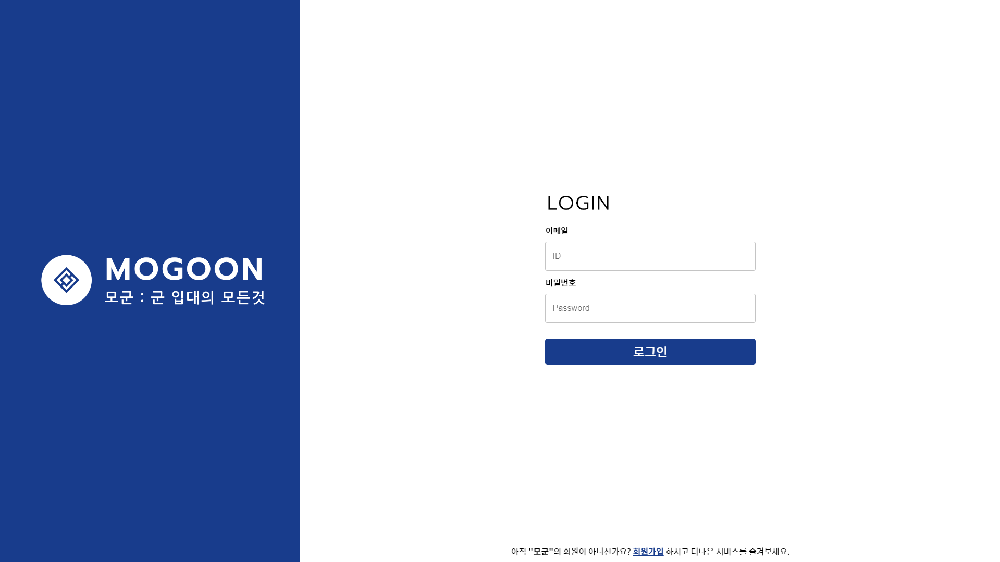
        </p>
      </td>
    </tr>
    <tr>
      <td align="center">
        모군에 로그인하여 찜, 마이페이지 등 더나은 서비스를 즐길수 있습니다.<br>
      </td>
    </tr>
  </table>
  
    <table>
    <tr>
      <td align="center">
        <p align="center">
          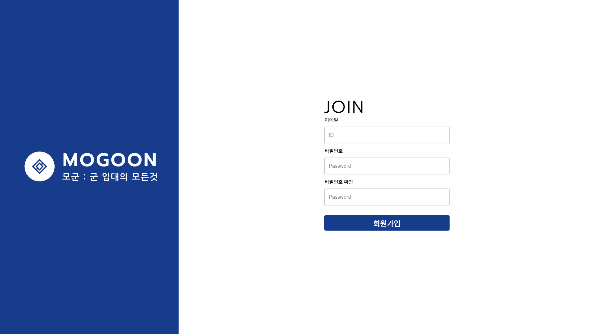
        </p>
      </td>
    </tr>
    <tr>
      <td align="center">
        모군에 회원가입 할 수 있습니다.<br>
	아이디는 이메일 형식입니다.<br>
	비밀번호는 최소 6자리 입니다.<br>
      </td>
    </tr>
  </table>
  
## 🔧기술 스택 (Technique Used) 
### Back-End
- [](https://nodejs.org/)
- [](https://www.npmjs.com/package/nodemon)
- [](https://www.npmjs.com/package/dotenv)
- [](http://expressjs.com///)
- [](https://firebase.google.com/)
  - [Firestore](https://firebase.google.com/products/firestore/?hl=ko&gclid=CjwKCAjwzY2bBhB6EiwAPpUpZizkG0R1NKfGAIX-UTFZhUkG0OWTFRIqYh9wqd9UxDvhhJYvGhdTaBoC0p0QAvD_BwE&gclsrc=aw.ds)
  - [Firebase Auth](https://firebase.google.com/docs/auth)
  - [Firebase Admin SDK](https://firebase.google.com/docs/auth/admin?hl=ko)
 
### Front-End
- [](https://ko.reactjs.org/)
- [](https://ko.redux.js.org/introduction/getting-started/)
- [](https://mui.com/)
### UI & Design
- [Figma](https://www.figma.com/)

## 설치 안내 (Installation Process)
 - 프로젝트 진행하면서 수정할 예정입니다.
 1. 프론트 앱을 빌드 합니다.

    ```shell
    $ cd WEB\(FE\)/mogoon/
    $ npm install -- force
    $ npm run build
    ```

 2. 데이터베이스 접속을 위해 백엔드 폴더에 .env 파일을 생성합니다. 이 과정은 개발자에게 문의해주세요.

 3. 백엔드 서버를 실행합니다.

    ```shell
    $ cd ../../WEB(BE)/
    $ npm install
    $ npm start
    ```

 4. http://127.0.0.1:5000 에서 결과물을 확인할 수 있습니다.

## 프로젝트 사용법 (Getting Started)
- 로그인 없이도 특기 소개를 읽어볼 수 있습니다.
- 로그인을 하면 마이페이지 기능을 사용할 수 있고, 특기 상세 설명 페이지에서 의견을 남길 수 있습니다.
 
## 팀 정보 (Team Information)
|이름|역할|이메일|깃허브|
|:---:|:---:|:---:|:---:|
|권찬|팀장, 기획, 백엔드|kckc0608@naver.com|kckc0608|
|김태환|기획, 프론트|vnddnjf1234@naver.com|WBCode3|

## 저작권 및 사용권 정보 (Copyleft / End User License)
 * [MIT](https://github.com/osam2020-WEB/Sample-ProjectName-TeamName/blob/master/license.md)

This project is licensed under the terms of the MIT license.
